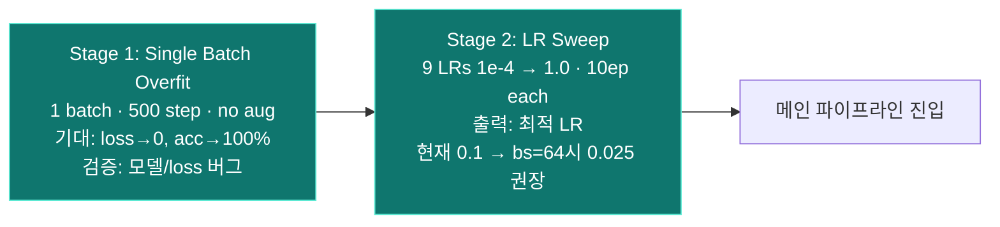

# PyramidNet-272 학습 파이프라인 (현재 코드 기준)

> 본인 담당: **PyramidNet 단일 모델** 학습/평가까지.
> WideResNet · DeiT 및 3-way 앙상블은 타 팀원이 별도 진행 → 점선 박스로 표기.

## 메인 파이프라인 (Mermaid)

```mermaid
flowchart TD
    %% ============== DATA ==============
    A[CIFAR-100<br/>train 50k / val 10k] --> B[증강<br/>AutoAugment + Cutout 16px<br/>+ CutMix α=1.0, p=0.5]
    B --> C[DataLoader<br/>bs=64 권고 · num_workers=6]

    %% ============== MODEL ==============
    C --> D[PyramidNet-272 α=200<br/>Bottleneck · ~28.2M params<br/>+ ShakeDrop p:0→0.5]

    %% ============== TRAINING ==============
    D --> E[학습 루프 — train.py<br/>SGD-Nesterov · momentum=0.9<br/>weight_decay=1e-4 · grad-clip 5.0<br/>AMP enabled]
    E --> F[Scheduler<br/>linear warmup 5ep<br/>→ CosineAnnealing · η_min=1e-4<br/>lr=0.05 · WD=1e-4]
    F --> G[Loss — HierarchicalLoss λ=0.8<br/>0.2·CE_fine + 0.8·NLL_coarse]
    G --> H{epoch ≥ 750?}
    H -- 아니오 --> E
    H -- 예 --> I[SWA 가동<br/>last 250ep · swa_lr=lr×0.05<br/>BN 재계산]
    I --> J[Best ckpt 저장<br/>checkpoints/best_seed{}.pth<br/>+ swa_final_seed{}.pth]

    %% ============== EVAL ==============
    J --> K[평가 — evaluate.py<br/>TTA: 원본 + hflip 2-view<br/>logit 평균]
    K --> L[Super-class re-scoring<br/>P&#40;fine&#41; × P&#40;super&#124;fine&#41;]
    L --> M[메트릭<br/>Fine Top-1 / Super-Class Acc<br/>목표: ≥84% / ≥93%]

    %% ============== REPRODUCIBILITY ==============
    M --> N[3-seed 재현성 — run_seeds.py<br/>seeds = 42, 0, 1<br/>mean ± std 보고]

    %% ============== TEAM ENSEMBLE (외부) ==============
    N -. logits 전달 .-> X[팀 통합 단계 - 외부<br/>WideResNet + DeiT + PyramidNet<br/>Soft voting 앙상블]

    %% ============== STYLE ==============
    classDef data fill:#1e3a8a,stroke:#60a5fa,color:#fff
    classDef model fill:#5b21b6,stroke:#a78bfa,color:#fff
    classDef train fill:#065f46,stroke:#34d399,color:#fff
    classDef swa fill:#7c2d12,stroke:#fb923c,color:#fff
    classDef eval fill:#831843,stroke:#f472b6,color:#fff
    classDef ext fill:#1f2937,stroke:#9ca3af,color:#9ca3af,stroke-dasharray: 5 5

    class A,B,C data
    class D model
    class E,F,G,H train
    class I,J swa
    class K,L,M,N eval
    class X ext
```

## 초기 검증 (1회성 · 본 학습 전)

> 향후 [train.py](../train.py)에 `--mode {overfit_batch, lr_sweep}` CLI 플래그로 추가 예정 (Phase E).



## 핵심 설정 표 (현재 vs 권고)

| 항목 | 33.78% 실험 | 코드(중간 상태) | **권고 (확정)** | 근거 |
|---|---|---|---|---|
| BATCH_SIZE | 64 | 256 | **64** | VRAM ~6-8GB 안에 들어옴 |
| LR | 0.2 (표준의 4×) | 0.1 (표준의 0.5×) | **0.05** | PyramidNet 원논문 reference (bs=128, lr=0.1)에서 linear scaling. lr/sample = 7.8e-4 |
| WEIGHT_DECAY | 5e-4 | 5e-4 | **1e-4** | ShakeDrop 원논문 값. ShakeDrop+Cutout과 중첩 정규화 완화 |
| EPOCHS | 200 | 1000 | 1000 유지 | 1800ep 과도, 500ep 부족 |
| SWA_EPOCHS | (없음) | 250 | 250 유지 | epoch 75%부터 SWA |
| Warmup | 5ep | 5ep | 5ep | 작은 배치도 deep network엔 필요 |
| AMP | (없음) | ON | ON | 메모리/시간 절감 |
| Grad clip | (불명) | 5.0 | 5.0 | gradient explosion 방지 |
| AutoAug+Cutout | (없음) | ON | ON | 33.78% 실험 대비 정규화 추가 |

## 지표 목표

- **Fine Top-1 ≥ 84%** (현재 baseline ~33.78% — 미수렴 상태, LR sweep으로 진단 필요)
- **Super-Class Accuracy ≥ 93%**
- 3-seed 평균 ± 표준편차 보고

## 변경된 점 (원본 다이어그램과의 차이)

| 원본 다이어그램 | 현재 | 변경 사유 |
|---|---|---|
| Karpathy 4-stage 메인 흐름 | 단일 풀 파이프라인 | train.py가 단일 흐름으로 구현됨. Stage 1·2는 사이드 노트로 분리. |
| Best LR = 0.2 | 0.1 (현재) / 0.025 (권고) | LR sweep 결과 미반영 + bs 변경에 따른 scaling. |
| bs=64, 200ep | bs=64(권고), 1000ep | 실제 학습 epoch 수 증가. |
| 3-way ensemble (메인 박스) | 점선 외부 박스 | 본인은 PyramidNet 단독 담당. |
| TTA: hflip + 4-corner crop | hflip 2-view만 | [evaluate.py](../evaluate.py)의 4-corner는 dead code (87-95줄). |
| Soft voting T=1.5 | 제거 | 미구현, 팀 통합 단계 미정. |
| AMP·SWA·AutoAugment·Cutout·grad-clip 미언급 | 명시 | 모두 [train.py](../train.py)에 구현됨. |
| Super-class re-scoring | 유지 ✓ | [evaluate.py:58-73](../evaluate.py) 구현됨. |
